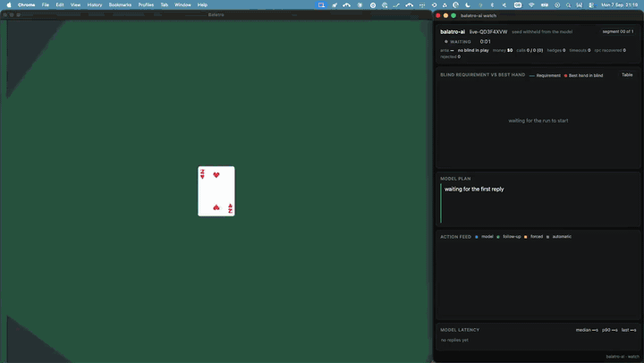
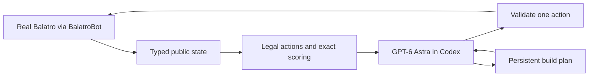

# Balatro AI

**The strongest published Balatro AI we know of: it has won every game it has played.**

Four recorded games on the real game client, four Ante 8 clears, three of them
carried on into endless mode past Ante 10 and one to Ante 13 with a single hand of
**134,231,931,235 chips**. No other public agent reports a run like it: the best
model on the [BalatroBench](https://gigazine.net/gsc_news/en/20260213-balatrobench/)
leaderboard clears Ante 8 in 9 of 15 runs, and the ten heuristic and search
policies in this repository's own baseline panel won at most 3 games in 20.

How: GPT-6 Astra, at low reasoning effort, makes every strategic decision from public
information only. Python does what a strong player's arithmetic does, enumerating
legal moves, scoring hands exactly, validating each reply and executing it through
the [BalatroBot](https://github.com/coder/balatrobot) mod. No training, no
simulator, no fallback policy, no hidden information.

## Watch it play



One full game in twenty seconds: the real game on the left, the live `balatro watch`
dashboard on the right. Seed QD3F4XVW, played end to end by `balatro supervise`
with no human input: Ante 8 cleared against Cerulean Bell, Ante 11 reached in
endless mode with a 7,052,918 hand, and not one illegal reply in 388 model calls.
Full length: [`recording-timelapse.mp4`](evidence/astra-low-QD3F4XVW/recording-timelapse.mp4);
last frame: [`final-frame.jpg`](evidence/astra-low-QD3F4XVW/final-frame.jpg). On the
baseline seed D0000000, where every heuristic in the panel played the same cards, the
best of them reached Ante 6 with a 14,700 peak; the model reached Ante 10 with
1,840,907 ([`evidence/astra-low-D0000000`](evidence/astra-low-D0000000)).


## Results

| System | Games | Ante 8 cleared | Notes |
|---|---|---|---|
| Astra low + tools, headless | 1 | 1 | Seed TAF7DNTX. Won, then reached Ante 13 in endless with a 134,231,931,235 hand. 456 decisions from 404 model calls; the runner was restarted four times at safe moments to deploy fixes, never inside a blind. |
| Astra low + tools, supervised | 1 | 1 | Seed QD3F4XVW. Won, then reached Ante 11 in endless with a 7,052,918 hand. 473 decisions from 388 model calls, zero rejected replies, one automatic restart; recorded end to end. |
| Astra low + tools, on a panel seed | 1 | 1 | Seed D0000000. Won, then reached Ante 10 in endless with a 1,840,907 hand. 315 decisions from 265 model calls, zero rejected replies. Every heuristic baseline played this seed; the best reached Ante 6. |
| Astra low + tools | 1 | 1 | Seed 2K9H9HN. Won, then reached Ante 11 in endless with a 1,239,454 hand. Supervised run with adapter fixes between segments. |
| search-v6 (best heuristic) | 20 | 3 | Bounded public-information search, the strongest of ten non-model policies. |
| Ten heuristic and search policies | 200 | 0 to 3 each | Same game, same settings, seeds D0000000 to D0000019. |

The coached games are four single games, three on seeds outside the baseline panel
and one on a panel seed. They show the system can beat the game and keep scaling
in endless mode; they do not estimate a win rate, and the unattended win rate is
unmeasured. Full tables, figures and every caveat: [docs/results.md](docs/results.md).
How the numbers are produced and what is disclosed: [docs/methodology.md](docs/methodology.md).


## How it works



- **Information firewall.** The model receives typed public observations and
  unordered deck counts. Seeds, draw order, hidden Joker identities and future shop
  contents never reach it. Tests assert the boundary.
- **Exact tools, advisory only.** Candidate plays come with exact scores where the
  outcome is deterministic. On the recorded run, 46 of 47 plays with visible Jokers
  replayed exactly. The model may choose any validated legal move.
- **One call, several actions.** Each decision runs in a fresh sandboxed Codex process
  with a compact persistent plan. A reply may chain follow-up shop actions and a
  bounded reroll loop; every follow-up is re-validated against fresh state and the
  chain stops silently at the first problem. Invalid replies get at most two
  corrections. An uncertain game mutation is never replayed.
- **Bounded work.** Calls, actions, wall-clock and per-call time are capped before
  anything runs. The runner acts alone only on cashouts and on forced moves where a
  single legal action exists.

Details: [docs/architecture.md](docs/architecture.md). The coach instructions are
in [`balatro_ai/prompts/coach.md`](balatro_ai/prompts/coach.md); the offline
strategy library and its retrieval rules are described in
[docs/strategy-library.md](docs/strategy-library.md).

## Reproduce the benchmarks

Everything in `benchmarks/results/` is rebuilt from `evidence/` without a game or
a model:

```sh
python3 -m venv .venv && . .venv/bin/activate
pip install -e '.[dev,bench]'
python -m benchmarks        # writes benchmarks/results/{results.json,results.md,figures/}
pytest -q                   # recorded observations and fake transports only
```

CI rebuilds the tables and fails if they change. New real-game results are added by
pointing the builder at run directories: `python -m benchmarks --runs runs/*`.

## Play a game

Requires Python 3.11+, macOS or Linux, the Codex CLI signed into ChatGPT (developed
against 0.153.4), and your own copy of Balatro with BalatroBot installed. The runner
does not install or launch the game and ships no game assets.

```sh
pip install -e .
codex login
BALATROBOT_ALL_UNLOCKED=1 uvx balatrobot serve --fast --headless --logs-path runs/logs
balatro doctor                     # read-only readiness check, no model calls
balatro play --endless --output runs/endless-001
```

The product is fixed to `gpt-6-astra` at low reasoning effort. Defaults cap a run
at 450 coach calls, 750 actions, 7200 seconds and 60 seconds per call
(`--max-calls`, `--max-actions`, `--seconds`, `--call-seconds`); they bound work,
not price. They are sized for a full endless game — the recorded Ante 13 run took
456 decisions, 404 model calls and 98 active minutes — so an Ante 8 win (drop
`--endless`) finishes well inside them. `--seed` selects a reproducible seed that
stays in the manifest. Use one game instance: separate BalatroBot ports do not
isolate the shared profile.

The Codex service stalls on roughly one call in ten, with the process idle and no
output. A call that has not answered after twenty seconds is hedged with a second
identical process and the first valid answer wins; a call that hits
`--call-seconds` is re-asked with a fresh request id, up to six attempts with a
pause. Every timeout is recorded in the trajectory and counted in `result.json`
(`coach_timeouts`). None of this touches the game: an uncertain game mutation is
never retried.

Ctrl-C records an interruption and stops the Codex child; the game is left alone.
`balatro play --resume runs/endless-001 --output runs/endless-001b` continues from
the recorded trajectory after checking the live game against the last recorded
transition, so a run can be stopped while it is waiting on a model call and picked
up later. The manifest reports whether the live state had moved on
(`resume_adjusted`).

To answer the packets yourself or from another model, use session mode:

```sh
balatro play --coach session --output runs/session-001 --call-seconds 600
balatro next runs/session-001/public            # read the outstanding request
balatro reply runs/session-001/public response.json
```

Each run writes `manifest.json`, `trajectory.jsonl` and `result.json`. The
trajectory is append-only JSON lines, so `tail -f` it to watch a game live;
`balatro inspect DIR` prints the result, for example
`balatro inspect evidence/astra-low-TAF7DNTX`. For a live view, `balatro watch DIR`
serves a dashboard at http://127.0.0.1:8765 from the standard library alone: the
requirement-versus-best-hand chart, the model's current plan, the action feed and a
compact status line, with the full stat tiles behind `?tiles=1` and `?zoom=0.8` for
narrow windows. Point it at a game root and it follows every segment.

For an unattended game, use the supervisor instead of `play`:

```sh
balatro supervise --endless --seed QD3F4XVW --output runs/game-002 \
  --server-command 'BALATROBOT_ALL_UNLOCKED=1 uvx balatrobot serve --gamespeed 1 --no-fast --animation-fps 60'
```

It writes one segment directory per runner process under the root, resumes
automatically after any exit that is not a finished game, relaunches the server
if it is unreachable, restores the run from Balatro's autosave if the game process
died, and stops on a real end, a Codex login problem, an exhausted budget or the
restart cap. `balatro watch runs/game-002` shows the whole game.

## Evidence

- [`evidence/astra-low-TAF7DNTX/`](evidence/astra-low-TAF7DNTX): the headless
  Ante 13 run, five hash-chained segments with the runner revision and reason for
  each restart.
- [`evidence/astra-low-QD3F4XVW/`](evidence/astra-low-QD3F4XVW): the supervised,
  recorded game, two segments, supervisor records, time-lapse video and GIF, the
  final frame and the dashboard at game over.
- [`evidence/astra-low-D0000000/`](evidence/astra-low-D0000000): the recorded
  game on the baseline seed, four segments, the same-seed comparison with every
  heuristic, the time-lapse video and GIF, and the dashboard at game over.
- [`evidence/astra-low-2K9H9HN/`](evidence/astra-low-2K9H9HN): the earlier win
  and endless continuation, in hash-chained segments with the interrupted first
  attempt kept separately.
- [`evidence/first-win/`](evidence/first-win): an earlier high-effort run of a
  previous version of this system, kept for the record. It is not part of the
  published results.
- [`evidence/baselines/`](evidence/baselines): twelve real-game panels of the earlier
  non-model policies, with [provenance](evidence/baselines/PROVENANCE.md).
- [docs/coached-win.md](docs/coached-win.md) and
  [docs/trajectory-review.md](docs/trajectory-review.md): what the runs did, what
  they got wrong, and what was fixed afterwards.

## Limitations

- Four coached wins on four seeds. No win rate, no model-without-tools control.
  The D0000000 game is the only same-seed comparison with the heuristics.
- Both runs were watched by an operator. The earlier one had adapter fixes between
  segments; the later one had runner restarts at safe moments to deploy the retry,
  resume and hedging fixes, with the model never given hints or corrections.
- The Codex service stalls on roughly one call in ten. Hedged calls and retries
  keep a game alive through that, at a cost in wall-clock time; a decision takes
  about nine seconds when the service answers promptly.
- Scoring approximates random effects and withholds advice when hidden cards or
  Jokers make an estimate unsound.
- Model access is your own Codex CLI and ChatGPT account. There is no API client
  and no token or cost accounting in the evidence.

## License

Code is licensed under the GNU Affero General Public License v3.0 or later
([LICENSE](LICENSE)). Documentation, evidence and generated results are CC BY 4.0
([LICENSE-DOCS](LICENSE-DOCS)). Balatro is a game by LocalThunk, published by
Playstack; this project is unaffiliated and includes no game assets. BalatroBot is
MIT licensed by Coder. See [NOTICE](NOTICE). To cite, use [CITATION.cff](CITATION.cff).
