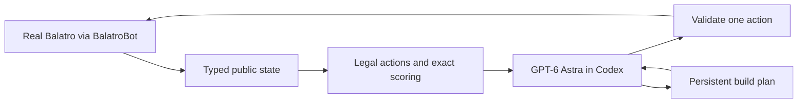

# Balatro AI

An LLM coach with exact numerical tools that clears Balatro on the real game.

GPT-6 Astra at low reasoning effort chooses every strategic action from public
information only. Python enumerates legal moves, scores hands exactly, validates each
reply and executes it through the [BalatroBot](https://github.com/coder/balatrobot)
mod. No training, no simulator, no fallback policy, no hidden information. Both
recorded games cleared Ante 8 on Red Deck / White Stake; the latest went on to
Ante 13 in endless mode with a 134 billion chip hand, where ten earlier heuristic
and search policies won at most 3 games in 20.


## Results

| System | Games | Ante 8 cleared | Notes |
|---|---|---|---|
| Astra low + tools, headless | 1 | 1 | Seed TAF7DNTX. Won, then reached Ante 13 in endless with a 134,231,931,235 hand. 456 decisions from 404 model calls; the runner was restarted four times at safe moments to deploy fixes, never inside a blind. |
| Astra low + tools | 1 | 1 | Seed 2K9H9HN. Won, then reached Ante 11 in endless with a 1,239,454 hand. Supervised run with adapter fixes between segments. |
| search-v6 (best heuristic) | 20 | 3 | Bounded public-information search, the strongest of ten non-model policies. |
| Ten heuristic and search policies | 200 | 0 to 3 each | Same game, same settings, seeds D0000000 to D0000019. |

The coached games are two single games on seeds outside the baseline panel. They
show the system can beat the game and keep scaling in endless mode; they do not
estimate a win rate, and the unattended win rate is unmeasured. Full tables, figures and every caveat: [docs/results.md](docs/results.md).
How the numbers are produced and what is disclosed: [docs/methodology.md](docs/methodology.md).


## How it works



- **Information firewall.** The model receives typed public observations and
  unordered deck counts. Seeds, draw order, hidden Joker identities and future shop
  contents never reach it. Tests assert the boundary.
- **Exact tools, advisory only.** Candidate plays come with exact scores where the
  outcome is deterministic. On the recorded run, 46 of 47 plays with visible Jokers
  replayed exactly. The model may choose any validated legal move.
- **One call, several actions.** Each decision runs in a fresh sandboxed Codex process
  with a compact persistent plan. A reply may chain follow-up shop actions and a
  bounded reroll loop; every follow-up is re-validated against fresh state and the
  chain stops silently at the first problem. Invalid replies get at most two
  corrections. An uncertain game mutation is never replayed.
- **Bounded work.** Calls, actions, wall-clock and per-call time are capped before
  anything runs. The runner acts alone only on cashouts and on forced moves where a
  single legal action exists.

Details: [docs/architecture.md](docs/architecture.md). The coach instructions are
in [`balatro_ai/prompts/coach.md`](balatro_ai/prompts/coach.md); the offline
strategy library and its retrieval rules are described in
[docs/strategy-library.md](docs/strategy-library.md).

## Reproduce the benchmarks

Everything in `benchmarks/results/` is rebuilt from `evidence/` without a game or
a model:

```sh
python3 -m venv .venv && . .venv/bin/activate
pip install -e '.[dev,bench]'
python -m benchmarks        # writes benchmarks/results/{results.json,results.md,figures/}
pytest -q                   # recorded observations and fake transports only
```

CI rebuilds the tables and fails if they change. New real-game results are added by
pointing the builder at run directories: `python -m benchmarks --runs runs/*`.

## Play a game

Requires Python 3.11+, macOS or Linux, the Codex CLI signed into ChatGPT (developed
against 0.153.4), and your own copy of Balatro with BalatroBot installed. The runner
does not install or launch the game and ships no game assets.

```sh
pip install -e .
codex login
BALATROBOT_ALL_UNLOCKED=1 uvx balatrobot serve --fast --headless   # game side
balatro doctor                     # read-only readiness check, no model calls
balatro play --output runs/game-001
balatro play --endless --output runs/endless-001
```

The product is fixed to `gpt-6-astra` at low reasoning effort. Defaults cap a run
at 200 coach calls, 400 actions, 3600 seconds and 180 seconds per call
(`--max-calls`, `--max-actions`, `--seconds`, `--call-seconds`). `--seed` selects a
reproducible seed that stays in the manifest. Ctrl-C records an interruption and
stops the Codex child; the game is left for inspection. Use one game instance:
separate BalatroBot ports do not isolate the shared profile.

To answer the packets yourself or from another model, use session mode:

```sh
balatro play --coach session --output runs/session-001 --call-seconds 600
balatro next runs/session-001/public            # read the outstanding request
balatro reply runs/session-001/public response.json
```

Each run writes `manifest.json`, `trajectory.jsonl` and `result.json`. Read them
with `balatro inspect DIR`, for example `balatro inspect evidence/astra-low-2K9H9HN`.

## Evidence

- [`evidence/astra-low-TAF7DNTX/`](evidence/astra-low-TAF7DNTX): the headless
  Ante 13 run, five hash-chained segments with the runner revision and reason for
  each restart.
- [`evidence/astra-low-2K9H9HN/`](evidence/astra-low-2K9H9HN): the earlier win
  and endless continuation, in hash-chained segments with the interrupted first
  attempt kept separately.
- [`evidence/first-win/`](evidence/first-win): an earlier high-effort run of a
  previous version of this system, kept for the record. It is not part of the
  published results.
- [`evidence/baselines/`](evidence/baselines): twelve real-game panels of the earlier
  non-model policies, with [provenance](evidence/baselines/PROVENANCE.md).
- [docs/coached-win.md](docs/coached-win.md) and
  [docs/trajectory-review.md](docs/trajectory-review.md): what the runs did, what
  they got wrong, and what was fixed afterwards.

## Limitations

- Two coached wins on two seeds. No win rate, no same-seed ablation of model versus
  tools, no model-without-tools control.
- Both runs were watched by an operator. The earlier one had adapter fixes between
  segments; the later one had runner restarts at safe moments to deploy the retry,
  resume and hedging fixes, with the model never given hints or corrections.
- The Codex service stalls on roughly one call in ten. Hedged calls and retries
  keep a game alive through that, at a cost in wall-clock time; a decision takes
  about nine seconds when the service answers promptly.
- Scoring approximates random effects and withholds advice when hidden cards or
  Jokers make an estimate unsound.
- Model access is your own Codex CLI and ChatGPT account. There is no API client
  and no token or cost accounting in the evidence.

## License

Code is licensed under the GNU Affero General Public License v3.0 or later
([LICENSE](LICENSE)). Documentation, evidence and generated results are CC BY 4.0
([LICENSE-DOCS](LICENSE-DOCS)). Balatro is a game by LocalThunk, published by
Playstack; this project is unaffiliated and includes no game assets. BalatroBot is
MIT licensed by Coder. See [NOTICE](NOTICE). To cite, use [CITATION.cff](CITATION.cff).
