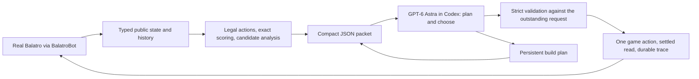

# Architecture

One real game, one model, exact public tools. The model owns strategy and every
meaningful action. Python owns legality, arithmetic, validation, execution and
logging. Cashout is the only automatic decision.

## The loop

1. `client.py` reads the game over BalatroBot's JSON-RPC on `127.0.0.1:12346`.
2. `game/adapter.py` and `game/codec.py` convert the raw state into typed public
   observations. Hidden information never crosses this boundary: no deck order, no
   hidden Joker identities, no future shop contents, no seed.
3. `game/actions.py` enumerates the legal actions for the phase. `game/scoring.py`,
   `game/boss_rules.py`, `game/consumable_rules.py` and `game/mechanics.py` compute
   exact hand scores and rule effects. `analysis.py` turns those into a bounded set of
   scored candidates, growth-preserving options and held-card facts.
   `strategy.py` retrieves at most three conditional examples from the offline
   strategy library for the current situation.
4. `packet.py` assembles the public packet: current state, recent outcomes,
   candidates, retrieved examples and the coach's own previous plan. Repeated
   records use column tables to keep the packet small.
5. `coach.py` sends the packet to a fresh, sandboxed Codex process
   (`codex exec` with `--sandbox read-only`, web search disabled, ephemeral
   context) and receives a schema-checked JSON reply: one action plus an updated
   plan. Model and effort are fixed in code. Environment variables containing
   `API_KEY` are stripped before the child starts.
6. `runner.py` validates the reply against the exact outstanding request and the
   current legal actions. Invalid replies get validation feedback for at most two
   corrections. A validated action is executed once. Uncertain mutations are never
   retried. The runner waits for settled public state, appends the transition to
   `trajectory.jsonl`, and repeats.
7. A reply may also carry a short chain of follow-up shop actions, or a bounded
   reroll loop with a stop list and a money floor. The runner resolves item keys
   against the fresh state, validates each follow-up as if it were a new decision,
   executes it once, and stops the chain silently at the first illegal or
   unresolvable step. The next packet reports how far the chain got. When only one
   legal action exists, such as selecting a boss blind, the runner takes it without
   a call and reports that too.

## Boundaries that matter

- **Information firewall.** The coach sees only the packet. Tests in
  `tests/` assert that seeds, deck order and hidden identities never appear in it.
- **No fallback policy.** If the model cannot produce a valid action within the
  limits, the run stops and records why. There is no heuristic that quietly takes
  over. The runner acts alone only on cashouts, on forced moves with a single
  legal action, and on follow-ups the model spelled out in its own reply.
- **No retries of game mutations.** A transport failure after an action was sent
  ends the run rather than risk a double action.
- **Bounded work.** Calls, actions, wall-clock and per-call time are capped
  before any model or game action is taken.
- **No consumables while a pack is open.** The real game lets a held Tarot,
  Planet or Spectral be used while a booster pack is on screen, but the
  BalatroBot transport declares `requires_state = { G.STATES.SELECTING_HAND,
  G.STATES.SHOP }` for its `use` endpoint (`src/lua/endpoints/use.lua:39`), so a
  `use` call in any pack state is rejected with `INVALID_STATE` before it reaches
  the game. Legality therefore offers only pack choices, skips and inventory
  sales in `Phase.PACK`, and a held consumable has to wait until the pack is
  resolved.
- **Session mode.** `balatro play --coach session` replaces the Codex child with a
  request/response file exchange, so a human or a different model can answer the
  same packets. The bridge cannot verify which model answered.

## What the numerical tools are not

They are advice. The model can choose any validated legal move, including ones
the tools rank poorly. Scoring rules exist for the 102 Jokers that touch chips,
Mult or XMult; the other 48 are money, hand-size or shop effects and are listed as
such, so every Joker is in exactly one set and any active Joker without a rule is
named in the analysis rather than silently ignored. Blueprint and Brainstorm can
copy any Joker with a rule. Scoring uses expected values for Misprint and
Bloodstone and omits Lucky-card randomness, says so, and declines to advise when
hidden cards or hidden Jokers make the estimate unsound. The analysis also states
the interest earned at cashout and the next threshold. There is no Monte Carlo
discard search and no game simulator in this repository.

## Records

Each run directory holds `manifest.json` (settings, requested model and effort,
seed), `trajectory.jsonl` (requests, responses, rejections, mutation attempts and
settled transitions) and `result.json` (outcome, counts and timing).
`balatro inspect DIR` reads them without running anything. The evidence used in
[results](results.md) lives under `evidence/` in exactly this format, compressed.
