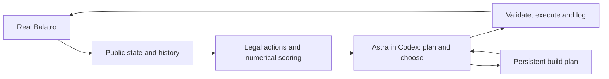

# Confirmed Balatro win: Astra with numerical tools

Recorded 2026-09-07. This is the run that established that the coached system
beats the game. No further evaluation of the high-effort configuration has been run.

## Verified result

- Actual Balatro, Red Deck / White Stake, all-unlocked profile.
- Development seed D0001000; seed withheld from the playing agent.
- Confirmed Ante-8 clear: runner observed Ante 9, not just the game's victory flag.
- Violet Vessel required 300,000 chips; final hand scored 415,042 with three hands
  and four discards unused. Peak hand across the run: 446,698.
- 203 executed decisions: 175 selected by Astra, 5 delegated to V6 (the `search-v6`
  public numerical policy, the strongest heuristic baseline in [results](results.md)),
  23 automatic cashouts. Runtime: 1,689.681 seconds. No execution error.
- Model: gpt-6-astra, high reasoning effort, through a fresh built-in Codex agent.
- No project-specific model training, direct model API client, hidden deck order,
  future shop access, or checkpoint search.

Evidence is tracked in [`evidence/first-win`](../evidence/first-win): the original
manifest, prompt, completed result and compressed public trajectory. The pre-rewrite
source that produced it, including V6, is in this repository's history before commit
`99cf692`; see `evidence/first-win/archive.json`.

The offline migration audit recomputed all 54 played-hand predictions with zero
change. Eighteen actual integer game scores differ from the fractional predictions
by less than one chip. See `evidence/first-win/scoring-audit.json`.

## Architecture actually used

The existing adapter strips private state. Python then prepares scored hand
candidates and a V6 recommendation. A public JSON packet includes the current
state, recent action outcomes, and the coach's previous plan. Astra reads it
through the exchange helper and returns an action plus an updated plan.

The file bridge validates the response against the exact outstanding request
and current legal actions. The existing runner executes it through the local
BalatroBot connection, waits for settled public state, and logs the outcome.
Then the loop repeats. Model access is through Codex; the game connection is
the existing local game RPC, a separate concern.

Astra decides strategy and can directly choose individual hands. It may explicitly
delegate hand tactics to V6 for the current blind; the last hand always returns
to Astra. In this winning run delegation was used for only five actions, so Astra
controlled nearly every meaningful decision, including many individual plays.
The numerical tools supplied estimates and recommendations, not a mandatory policy.
Scoring includes approximations for random or unsupported effects.

The implementation described above is historical and archived. The current product
uses the same public rules and scorer, with Astra at **low** effort and no V6
delegation. It has not been evaluated live. This evidence proves the previous
high-effort architecture won once; it does not prove the rewrite or low effort wins.

## Concrete behavior

The final build was Ride the Bus +48, Blueprint copying Hologram X3.25,
Blackboard, Blue Joker, and High Card level 11. Astra coordinated purchases,
growth plays, planets, seals, deck edits, and joker ordering. Examples include
preserving Bus from scoring-face resets, holding a Steel Blue Seal card for
scoring and Pluto generation, and changing Blueprint's target as Hologram grew.
It rejected some V6 recommendations that would undermine those commitments.

This establishes that the hybrid system beat a complete real game. It does not
yet measure general win rate or isolate the contribution of Astra versus the
tools. No same-seed V6 comparison or model-without-tools ablation was completed.
