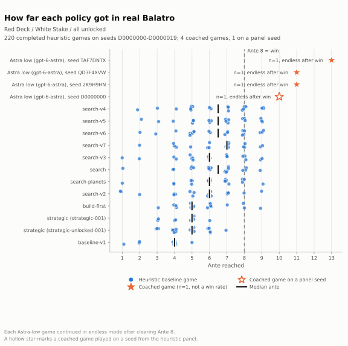
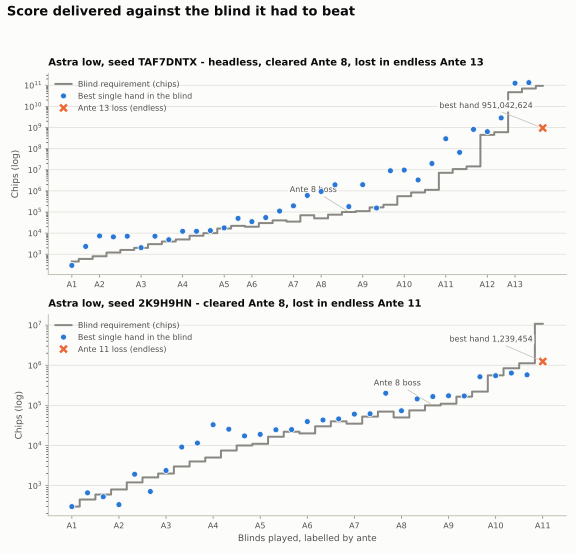

# Results

The Red/White benchmark numbers below are read from files under `evidence/` by `python -m benchmarks`,
which writes the machine-generated tables to
[`benchmarks/results/results.md`](../benchmarks/results/results.md) and
[`results.json`](../benchmarks/results/results.json). CI rebuilds them and fails if
they change. This page explains what they show. Method and disclosure rules are in
[methodology.md](methodology.md).

Two additional **Black Deck / Gold Stake wins**, with full archived traces and
fair-play disclosures, are reported in [Black/Gold results](black-gold-results.md).
They use a different difficulty and policy and are not pooled into the generated
Red/White tables or figures.

Setting for the tables below: real Balatro through BalatroBot, Red Deck, White Stake,
all-unlocked profile, complete games from Ante 1. A win is clearing the Ante 8 boss.

## Headline

Each dot is one complete game of a non-model policy on the fixed seed panel
D0000000 to D0000019. The stars are the coached games: the astra wins, and at
Ante 2 the two terra losses on the seed of the recorded astra game. The best heuristic
policies cleared Ante 8 in 3 of 20 games and reached Ante 8 or beyond in 7 of 20.
The coached system, GPT-6 Astra at low reasoning effort with numerical tools,
has five published Red/White Ante 8 clears across four historical runs and one
round-production-advice run. The highest ante reached was 13, with a peak hand of
134,231,931,235 chips. These runs used different versions and include documented
interventions; they demonstrate capability rather than estimate a win rate.
The unattended win rate remains unmeasured.

The fresh-seed round-production-advice run (`9395d7a`, XV2MP8L5) also cleared
Ante 8 and reached Ante 12, peaking at 326,543,967 chips. It is a separate policy
result, not evidence of improvement over the earlier seeds.

## Table A: real-game results

| System | Games | Ante 8 cleared | Reached Ante 8+ | Median ante | Seeds |
|---|---|---|---|---|---|
| Astra low + tools, round-production advice | 1 | 1 | 1 | 12 (endless) | XV2MP8L5 |
| Astra low + tools, headless | 1 | 1 | 1 | 13 (endless) | TAF7DNTX |
| Astra low + tools, supervised | 1 | 1 | 1 | 11 (endless) | QD3F4XVW |
| Astra low + tools, on a panel seed | 1 | 1 | 1 | 10 (endless) | D0000000 |
| Astra low + tools | 1 | 1 | 1 | 11 (endless) | 2K9H9HN |
| Terra low + tools, supervised | 2 | 0 | 0 | 2 | QD3F4XVW |
| search-v4 | 20 | 3 | 7 | 6.5 | D0000000-19 |
| search-v5 | 20 | 3 | 6 | 6.5 | D0000000-19 |
| search-v6 | 20 | 3 | 7 | 6.5 | D0000000-19 |
| search-v7 | 20 | 2 | 5 | 7 | D0000000-19 |
| search-v3 | 20 | 2 | 5 | 6 | D0000000-19 |
| search | 20 | 1 | 4 | 6.5 | D0000000-19 |
| search-planets | 20 | 1 | 4 | 6 | D0000000-19 |
| search-v2 | 20 | 1 | 2 | 6 | D0000000-19 |
| build-first | 20 | 1 | 3 | 5 | D0000000-19 |
| strategic | 20 | 0 | 0 | 5 | D0000000-19 |
| strategic (career profile pilot) | 10 | 0 | 0 | 5 | D0000000-09 |
| baseline-v1 (partial) | 11 | 0 | 0 | 4 | D0000000-10 |

Disclosures that belong with this table:

- **Astra low, round-production advice, XV2MP8L5** (policy `9395d7a`):
  seed generated by the game and absent from earlier run manifests; seed withheld
  from the model. Cleared Ante 8, lost to The Arm at Ante 12 with 19,198,174 of
  600,000,000 after all five hands. Peak hand 326,543,967. One uninterrupted
  segment, 515 decisions from 421 calls, 48 chained actions, 14 forced moves,
  zero rejected replies, six recovered model timeouts and one recovered game-reply
  timeout. The supervisor stopped on `endless_game_over` after 6,957.258 seconds,
  below every configured budget. No gameplay intervention or runtime strategy
  changes. Production context appeared in 147 requests; held Gold opportunities
  in 16, but no Purple/Blue opportunities or supported production-copier targets.
  Brainstorm was acquired late for scoring, so the new copier-timing guidance
  remains live-unvalidated. [Evidence and provenance](../evidence/astra-round-production-XV2MP8L5/README.md).

- **Astra low, headless, TAF7DNTX** (`gpt-6-astra`, low effort): skipped the Ante 1
  small blind for an Investment Tag, cleared the Ante 8 boss Crimson Heart with
  180,442 against 100,000, and lost to The Tooth at Ante 13 with 94 billion
  required. 456 decisions from 404 model calls: 378 chosen directly, 31 chained
  follow-ups the model spelled out, 13 forced moves with a single legal action,
  34 automatic cashouts. Eight replies were rejected as illegal and corrected on
  the next call. The Codex service stalled on 15 calls, all retried, and the hedge
  process answered 14 more. The runner process was stopped and resumed four times
  at safe moments, always while waiting for the model, to deploy runner fixes; the
  game state and trajectories were never edited. Details, hashes and the revision
  of each segment: `evidence/astra-low-TAF7DNTX/README.md`.
- **Astra low, QD3F4XVW** (`gpt-6-astra`, low effort, game visible at speed 2 and
  screen recorded in one take): the first game played end to end by
  `balatro supervise`. Cleared Ante 8 against Cerulean Bell with 111,598 against
  100,000; lowered the ante twice with Hieroglyph and Petroglyph to buy rounds;
  lost to The Plant at Ante 11 with 14,400,000 required. 473 decisions from 388
  calls, 50 chained, 6 forced, zero rejected replies, 3 stalls retried. One
  automatic restart after the mod refused a boss reroll the runner had considered
  legal; the supervisor resumed two seconds later with the live state verified.
  Details: `evidence/astra-low-QD3F4XVW/README.md`.
- **Astra low, D0000000** (`gpt-6-astra`, low effort, game window visible and screen
  recorded): the operator set the seed to the first seed of the baseline panel, so
  this is the one game where the model and every heuristic played identical cards.
  Cleared Ante 8 and lost to The House at Ante 10 with 1,120,000 required. 315
  decisions from 265 calls, 34 chained, 5 forced, zero rejected replies, 5 stalls
  retried, 1 game-reply timeout recovered by reading the live state. The runner
  was restarted three times at safe moments, once after the operating system
  killed every process including the game, which Balatro's autosave and
  BalatroBot's `load` restored; the differences the resume accepted are recorded
  in the manifests and the reconstructed segment result is marked. On the same
  seed the best heuristic, search-v5, reached Ante 6 with a 14,700 peak; the
  model's peak was 1,840,907. Details: `evidence/astra-low-D0000000/README.md`.
- **Astra low, 2K9H9HN** (`gpt-6-astra`, low effort): cleared Ante 8 after 303 decisions,
  then continued in endless mode and lost at Ante 11 with a peak hand of 1,239,454
  against a 10,800,000 requirement. 357 model calls covered 384 decisions; the
  other 30 were automatic cashouts. This was a supervised development run: adapter
  fixes, prompt clarifications, reviewed continuations and extended limits were
  applied between the seven recorded segments. No uncertain mutation was replayed.
  The segments and their SHA-256 hashes are in
  `evidence/astra-low-2K9H9HN/segments.json`.
- **Terra low, QD3F4XVW** (`gpt-5.6-terra`, low effort, game visible at speed 2,
  `balatro supervise`, same tools, prompts and limits as the astra game on this
  seed): two games, both lost at the Ante 2 boss The Mouth, which allows one hand
  type per round. The clean game took The Soul from the Ante 1 skip tag's pack,
  turned it into Triboulet, then opened the boss with a single King and locked the
  round to High Card: 356 of 1,600 after 36 decisions from 30 calls, zero rejected
  replies, median 10.9 seconds per call. The first attempt lost 496 to 1,600 after
  skipping four of the first five blinds; a runner fault, since fixed, selected the
  boss while a skip tag's Mega Buffoon Pack was opening, so that pack was never
  offered. A third attempt was stopped at Ante 1 by another runner fault and has no
  outcome. Details: `evidence/terra-low-QD3F4XVW/README.md` and
  `evidence/terra-low-QD3F4XVW-attempt1/README.md`. Both games are rows of the
  generated Table A and stars in the headline figure; the score and decision-mix
  figures cover the astra runs only.
- **Baselines**: ten complete 20-game panels plus two partial ones. One
  `baseline-v1` game ended with an error status and is excluded from ante
  statistics. The `strategic-001` pilot ran on the career profile, not
  all-unlocked. Sources and one-line policy descriptions are in
  [`evidence/baselines/PROVENANCE.md`](../evidence/baselines/PROVENANCE.md).
- An earlier high-effort run of a previous version of this system is kept under
  `evidence/first-win/` and described in [coached-win.md](coached-win.md). It is
  archived evidence and is not part of these results.

## Score against the requirement

The grey step is the chip requirement of each blind, which grows roughly
exponentially. Dots are the best single hand scored in that blind. A blind is
cleared by the sum of its hands, so dots below the step are normal in early antes.
In both games the best hand overtakes the requirement from Ante 4 onward and stays
there, which is what a scaling build looks like when it works. In the headless
run, Blueprint on Hanging Chad, Brainstorm on Photograph, Hologram and Steel Joker
kept pace with the endless curve through Ante 12; at Ante 13 the requirement of
94 billion outran a best hand of 951 million in that blind, even though the
previous blind had produced 134 billion.

## Scoring-engine exactness

| Run | Plays compared | Exact | Note |
|---|---|---|---|
| Astra low, 2K9H9HN | 47 | 46 | Offline replay after a Fortune Teller adapter fix made once the run was over, quoted from [trajectory-review.md](trajectory-review.md). The trajectory stores no per-play prediction, so it cannot be recomputed by the builder. The one miss involves a retriggered Lucky card, whose random Mult the scorer deliberately omits; two hidden-Joker plays were excluded. |

The scorer is the part of the system a reader can check without a model. When
the hand is deterministic and every Joker is visible, it predicts the real game's
score exactly.

## Decision mix in the headless run

| Source | Decisions |
|---|---|
| Model, one action per reply | 378 |
| Model, chained follow-ups | 31 |
| Forced move (single legal action) | 13 |
| Automatic cashout | 34 |
| Total | 456 |

| Phase | Decisions |
|---|---|
| Shop | 241 |
| Selecting a hand | 95 |
| Opening a pack | 47 |
| Choosing a blind | 39 |
| Round end (cashout) | 34 |

The shop is still where the calls go: 73 rerolls, 44 pack purchases, 45 consumable
uses, 40 card purchases and 34 shop exits across 78 visits with a median of 2 and a
maximum of 13 actions each. Hand plays and discards were 73. Follow-up chains
covered 31 of those shop actions and forced moves 13 blind selections, so 404 calls
produced 456 decisions. The earlier run needed 357 calls for 384 decisions. The
generated tables keep the earlier run's mix as a second block.

## What is not shown, and why

- No win rate for the coached system. Four games cannot support one.
- No model comparison. Two terra games and one astra game on one seed at one
  effort level say which model lost that seed, not which model is better.
- No same-seed comparison between the coached system and search-v6, and no
  model-without-tools control. Neither was run.
- No token or cost figures. The evidence run did not record them.
- Latency only as whole-run totals and per-call seconds inside the trajectories:
  the headless run took 5,883 active seconds for 404 calls, about 14.6 seconds
  each including stalls; calls the service answered promptly took about nine. The
  terra game on QD3F4XVW took a median 10.9 seconds per call against about 10 for
  astra on the same seed: the model swap did not change per-call latency.

New games can be added to every table and figure with
`python -m benchmarks --runs DIR...`; see [methodology.md](methodology.md).
